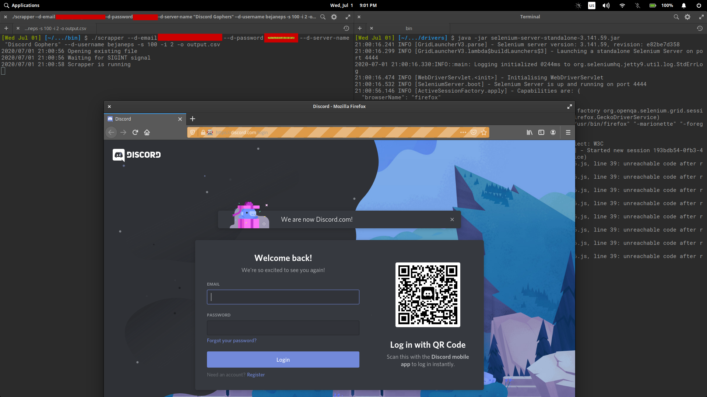
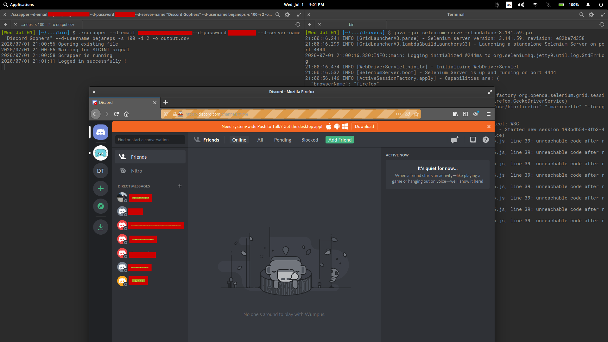
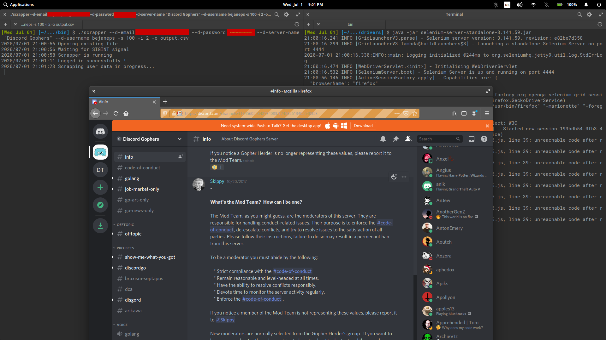
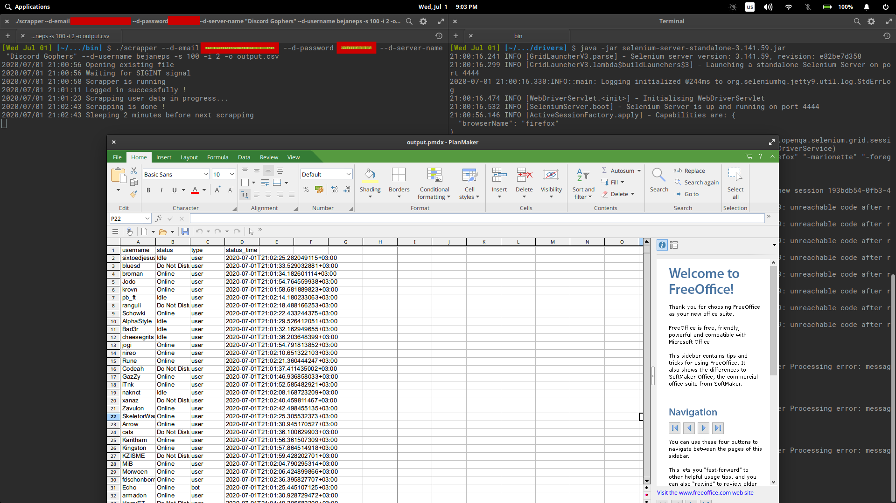

# Discord User Monitoring Tool

This tool is developed for [Upwork.com](https://www.upwork.com/jobs/Discord-Users-Online-Server-Activity-Monitoring-non-owned_%7E0162176f9f02ac5808) job.

It uses Selenium3 for automation and scrapping. Discord's official API doesn't allow user accounts to get user activity data from Servers(Guilds), such as status and etc(User Presence), it's only doable by bot accounts and only if they are added to particular server. Because of that issue, this tool was created.

**Caution**: using this tool violates Discord's Terms of Service, so it can get you permanently banned. Use it at your own risk.

# About

From client's description:
>In a particular discord server, I would like to log the activity of users over time. So if someone comes online, there would be a timestamp and the user's name. I would also like to track if they are on mobile. This would check every X time (can be adjusted), and simply append to a CSV. I would be using this on a windows PC, and the script/bot would only run for about 6 hours a day.

>I would like to monitor: User, Time, Online, Offline, Mobile, Usergroup(if possible).

>On this discord server that I will be monitoring, I DO NOT have owner/admin/moderation access. I'm a regular user. 

# Build

1. Download [golang](https://www.golang.org/), install and configure it.
2. Download this tool using either `go get -u -v github.com/bejaneps/discord-user-monitor` or `git clone https://github.com/bejaneps/discord-user-monitor.git`
3. Build program from source using _build.sh_ script for Linux, or _build.bat_ for Windows.
4. Run selenium standalone server in different terminal instance: `java -jar selenium-standalone-server.jar`
5. Change your folder to bin, and run tool.
6. You can view additional arguments and flags using `--help` argument. Example: `scrapper --help`

**Note**: you can download your own selenium drivers, from [selenium-website](https://www.selenium.dev/downloads/)

# Tool flags

1. `--selenium-port` - is a port of Selenium server, default is **4444**.
2. `--selenium-browser` - browser to use for scraping, for now _chrome_ and _firefox_ are available options, firefox appears to work faster, default **firefox**.
3. `--d-load-time` - time needed (in seconds) to load discord login page and then to login, if page won't load in specified seconds, then tool will throw error and exit, default **10**.
4. `--d-email` - Discord account email, used for login, without it tool won't run.
5. `--d-password` - Discord account password, used for login, without it tool won't run.
6. `--d-server-id` - Discord server ID, from where to scrap data, you can either use ID or Server Name, without it tool won't run.
7. `--d-server-name` - Discord server name, from where to scrap data, see above.
8. `--d-username` - Discord personal username, if this argument is supplied, then your username won't be added to final output file.
9. `--d-server-max-scrolls, -s` - amount of scrolls to be done for right user bar. For 0 to 10 users: 1, for 10 to 100 users: 10, for 100 to 1000 users: 100 and etc, default **150**.
10. `--d-server-scroll-refresh-time, -r` - time to wait (in milliseconds) after each scroll, value over 500 guarantees that all users will be scrapped, less than 500 will scrap faster, but with less chance of scrapping all users, default **300**.
11. `--output, -o` - path to final output file, which will be in .csv format, if not supplied, then tool will create temporary file in temporary directory.
12. `--scrapping-interval, -i` - time interval (in minutes) between each scrapping process, default **60**
13. `--log, -l` - path to log file, where all logs will be stored (in .log format)
14. `--help, -h` - view help message.

# Additional Information

Basically this tool logins into a Discord, clicks on a specified server link, and then starts to scrap data using user bar on right side, it has to scroll each time, because not all of the users are visible on page (lazy load technique). It stops to scroll when amount of max_scroll are reached, approximate time that will take it to finish: max_scrolls * scroll_refresh_time.

Real username is added to output file, not the one that's visible on each user icon. Type of user is added as well, like 'user' or 'bot'. Status can be several types, like: Online, Offline, Idle and etc. Status Time is a time when user status was scrapped.

# Screenshots

